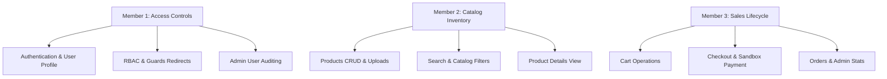

# Mini Daraz — Team Manual Testing & Verification Guide 🧪

This guide divides manual verification tasks among three team members. Each section lists the dedicated page features, API endpoints, and step-by-step test scripts for each member.

---

## 👥 Team Testing Assignment Overview

---

## 🔑 Member 1: Authentication, RBAC & User Management

### 💻 Scope & Routes to Test
- Frontend Views: `/login`, `/register`, `/profile`, `/admin/users`
- Route Guards: Verify redirection parameters for guest paths and role-protected links.

### 🔌 API Endpoints under Audit
- `POST /api/auth/register` (Public) - Create user profiles
- `POST /api/auth/login` (Public) - Credentials validation and token return
- `POST /api/auth/google` (Public) - Google OAuth verification
- `GET /api/auth/profile` (Private) - Retrieve logged-in profile details
- `GET /api/users` (Admin Only) - Audit database users accounts

### 📝 Step-by-Step Test Script

#### Test 1.1: Local Credentials Registration
1. Navigate to `/register` and attempt to submit an empty form. Verify browser validation prevents submit.
2. Enter invalid email syntax (e.g. `invalid-email`) or short password (e.g. `123`). Verify backend validation returns descriptive `400` errors.
3. Submit valid details (`customer@daraz.com` / `password123`). Verify instant navigation to the Home page with active session credentials saved.

#### Test 1.2: Credentials Login & Caching
1. Navigate to `/login`.
2. Input the registered email and password. Click **Sign In**.
3. Verify redirection to home page `/` and check browser LocalStorage to verify `token` and `user` properties are saved.

#### Test 1.3: Google OAuth Integration
1. Go to `/login` and locate the Google login button.
2. Click **Continue with Google**. Verify Google's authenticating modal pops up.
3. Select an account. Verify credentials validation and successful redirection.

#### Test 1.4: RBAC & Route Guards Redirects
1. While logged in as a standard Customer, attempt to directly navigate to `http://localhost:5173/admin` or `http://localhost:5173/admin/users` in the URL bar.
2. Verify you are automatically redirected back to `/` Home.
3. Log out. Attempt to navigate directly to `/profile` or `/cart`. Verify you are redirected to `/login`.

#### Test 1.5: Admin Users Auditing
1. Register another account at `/register`, then open your local MongoDB database (e.g., Compass or Mongo Shell) and update this user's `role` field directly to `"Admin"`.
2. Log in as this Admin user.
3. Navigate to `/admin/users` (via the sidebar). Verify you can view the complete user accounts registry showing user IDs, names, emails, role badges, and registration dates.

---

## 📦 Member 2: Products (CRUD, Search, Filters & Images)

### 💻 Scope & Routes to Test
- Frontend Views: `/products`, `/products/:id`, `/admin/products`
- Static Assets: Local product image uploads static resolution checks.

### 🔌 API Endpoints under Audit
- `GET /api/products` (Public) - Retrieve products catalog with query params
- `GET /api/products/:id` (Public) - Read single product specifications
- `POST /api/products` (Admin Only) - Create product with Multer image upload
- `PUT /api/products/:id` (Admin Only) - Edit product and optionally replace image
- `DELETE /api/products/:id` (Admin Only) - Delete product and clean file system

### 📝 Step-by-Step Test Script

#### Test 2.1: Admin Products CRUD & Image Storage
1. Log in as **Admin** and navigate to `/admin/products`.
2. Click **+ Create Product**. Complete the form details (name, price, category, stock), attach a local JPG/PNG image file, and click **Save Product**.
3. Verify the product appears in the table. Open the local directory `server/uploads/` and verify that the file exists with a sanitized timestamp filename.
4. Click **Edit** on your product. Modify the price, upload a *different* image, and click save.
5. Verify details are updated in the table. Check `server/uploads/` to confirm that the old image file was deleted automatically to save disk space.

#### Test 2.2: Public Catalog Search & Dynamic Query Sync
1. Open an incognito browser window and go to `/products`. Verify the product created by Admin is visible.
2. Type a matching keyword in the search bar and press enter. Check the URL bar: it should update to `/products?keyword=YourSearchString`.
3. Try searching an unmatched term (e.g., `xyz`). Verify the catalog shows the "No products found" placeholder screen.

#### Test 2.3: Categories and Price Range Filters
1. Go to the Filters sidebar on `/products`.
2. Select a category dropdown value (e.g., `Electronics`). Verify only matching items show.
3. Input Min/Max price boundaries (e.g., `1000` to `5000`) and click **Apply Filters**. Verify items adjust to respect price boundaries.

#### Test 2.4: Details View & Stock Limits Checks
1. Click on a product card to open its `/products/:id` details page.
2. Verify detailed descriptions, price, category, and images display correctly.
3. Observe the Stock indicator. If stock is, for example, `5`, verify the quantity dropdown selector restricts options up to `5`.
4. Login as Admin and edit the product stock to `0`. Return to the details page as a customer. Verify the product displays an **Out of Stock** badge and the **Add to Cart** button is disabled.

---

## 🛒 Member 3: Cart, Orders, Checkout & Admin Dashboard

### 💻 Scope & Routes to Test
- Frontend Views: `/cart`, `/orders`, `/admin`, `/admin/orders`
- Multi-step checkout payment sandbox wizard elements.

### 🔌 API Endpoints under Audit
- `/api/cart` (Customer) - Add, read, update, remove, and clear operations
- `POST /api/orders` (Customer) - Create order from cart (Checkout)
- `POST /api/orders/:id/pay` (Customer) - Simulated payment authorization
- `GET /api/orders/my-orders` (Customer) - Retrieve own order history
- `GET /api/orders` (Admin Only) - Audit all sales transactions
- `PUT /api/orders/:id/status` (Admin Only) - Edit order progress states

### 📝 Step-by-Step Test Script

#### Test 3.1: Cart Persistent Operations
1. Log in as a **Customer** and add a product to the cart with a quantity of `2`.
2. Navigate to `/cart`. Verify the item is listed and the order summary total is correct (`price * 2`).
3. Modify quantity to `4` using the dropdown. Verify the total price updates instantly.
4. Click **Remove** on the product. Verify the cart is empty and the total is reset to `0`.

#### Test 3.2: Checkout Wizard & Stock Audit
1. Add an item with stock `10` to your cart (select quantity `3`).
2. Go to `/cart` and click **Proceed to Checkout**.
3. Input a shipping address (min 10 characters) and submit.
4. Check the local MongoDB database:
   - Verify the product stock level has decremented from `10` to `7`.
   - Verify the user's cart is now empty.
   - Verify a new Order document exists with a status of `Pending` and a price snapshot of `price * 3`.

#### Test 3.3: Sandbox Credit Card Authorization
1. After submitting the checkout address, verify you are redirected to the **Card Payment** sandbox screen.
2. Input validation test: enter incomplete credit card details. Confirm form validation checks enforce 16 digits, expiry dates format, and a 3-digit CVV.
3. Input valid mock details:
   - Card: `4111 2222 3333 4444` (16 digits)
   - Expiry: `12/28` (MM/YY format)
   - CVV: `123` (3 digits)
4. Click **Pay**. Verify the transaction completes and shows the **Order Confirmed** success screen.
5. Click **View Order History**. Verify the order is marked as `Paid` and `Processing`.

#### Test 3.4: Admin Dashboard Overview & Metrics
1. Log in as **Admin** and navigate to the `/admin` dashboard.
2. Verify the statistics widgets show updated counts:
   - Total Revenue sum should include the subtotal of the paid order.
   - Total Orders count should increment by 1.
   - Total Users should display the registered customer counts.

#### Test 3.5: Admin Order Status Modifiers
1. In the Admin Panel, navigate to `/admin/orders`.
2. Locate the customer's order. Note its status: `Paid` / `Processing`.
3. Select `Shipped` from the status dropdown menu. Verify a success toast confirms the change.
4. Log back in as the **Customer** and go to `/orders`. Verify the order status has updated from `Processing` to `Shipped`.
5. Return to the Admin panel and modify the status to `Delivered`. Verify that once marked as `Delivered`, the dropdown disappears and displays "Order Closed", preventing further updates.
