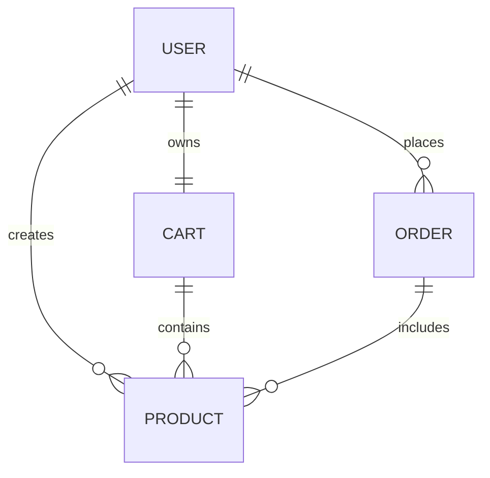

# Database Design Documentation - Mini Daraz

This document describes the MongoDB schema design and relationships for the **Mini Daraz** application.

---

## Collections & Schemas

### 1. User Collection

Stores information about registered customers and administrators.

| Field | Type | Required | Unique | Default | Notes |
| :--- | :--- | :--- | :--- | :--- | :--- |
| `_id` | ObjectId | Yes (Auto) | Yes | | Primary Key |
| `name` | String | Yes | No | | Trimmed, length: 2-50 |
| `email` | String | Yes | Yes | | Trimmed, lowercase, validated format |
| `password` | String | Yes* | No | | Hashed using bcrypt. *Optional if registering via Google OAuth |
| `googleId` | String | No | Yes* | `null` | Google Profile ID for OAuth *If provided, must be unique |
| `role` | String | Yes | No | `'Customer'` | Enum: `['Admin', 'Customer']` |
| `avatar` | String | No | No | `'default-avatar.png'` | Relative path or URL for profile picture |
| `createdAt` | Date | Yes (Auto) | No | | Managed by Mongoose `timestamps` |
| `updatedAt` | Date | Yes (Auto) | No | | Managed by Mongoose `timestamps` |

- **Indexes**:
  - Unique index on `email` for quick authentication and lookup.
  - Sparse unique index on `googleId` to allow standard users with `null` googleId.

---

### 2. Product Collection

Stores metadata and stock levels for items available in the store. Created and managed by Admin users.

| Field | Type | Required | Unique | Default | Notes |
| :--- | :--- | :--- | :--- | :--- | :--- |
| `_id` | ObjectId | Yes (Auto) | Yes | | Primary Key |
| `name` | String | Yes | No | | Trimmed, product name |
| `description`| String | Yes | No | | Detailed description of the product |
| `price` | Number | Yes | No | | Must be >= 0 |
| `category` | String | Yes | No | | Category name (e.g. Electronics, Clothing, etc.) |
| `stock` | Number | Yes | No | `0` | Must be >= 0 |
| `image` | String | Yes | No | | Relative path to local upload (e.g. `/uploads/image.png`) |
| `createdBy` | ObjectId | Yes | No | | References `User` collection (Ref: `'User'`) |
| `createdAt` | Date | Yes (Auto) | No | | Managed by Mongoose `timestamps` |
| `updatedAt` | Date | Yes (Auto) | No | | Managed by Mongoose `timestamps` |

- **Indexes**:
  - Compound or single index on `name` and `category` for search optimization.
  - Index on `price` for price range filters.

---

### 3. Cart Collection

Caches user cart items. Each registered customer can have at most one active cart.

| Field | Type | Required | Unique | Default | Notes |
| :--- | :--- | :--- | :--- | :--- | :--- |
| `_id` | ObjectId | Yes (Auto) | Yes | | Primary Key |
| `user` | ObjectId | Yes | Yes | | References `User` collection (Ref: `'User'`) |
| `items` | Array | Yes | No | `[]` | Nested subdocuments representing line items |
| `items.product`| ObjectId | Yes | No | | References `Product` (Ref: `'Product'`) |
| `items.quantity`| Number | Yes | No | `1` | Must be >= 1 |
| `totalPrice` | Number | Yes | No | `0` | Calculated subtotal of all items in cart |
| `createdAt` | Date | Yes (Auto) | No | | Managed by Mongoose `timestamps` |
| `updatedAt` | Date | Yes (Auto) | No | | Managed by Mongoose `timestamps` |

---

### 4. Order Collection

Maintains transactional logs of purchases. Created after a user completes a checkout sequence.

| Field | Type | Required | Unique | Default | Notes |
| :--- | :--- | :--- | :--- | :--- | :--- |
| `_id` | ObjectId | Yes (Auto) | Yes | | Primary Key |
| `user` | ObjectId | Yes | No | | References `User` collection (Ref: `'User'`) |
| `products` | Array | Yes | No | | List of items purchased, snapshots of price/details |
| `products.product`| ObjectId| Yes | No | | References `Product` (Ref: `'Product'`) |
| `products.quantity`| Number | Yes | No | | Must be >= 1 |
| `products.price`| Number | Yes | No | | Snapshot of the product price at checkout |
| `subtotal` | Number | Yes | No | | Total amount paid |
| `paymentStatus`| String | Yes | No | `'Pending'`| Enum: `['Pending', 'Paid', 'Failed']` |
| `orderStatus` | String | Yes | No | `'Pending'`| Enum: `['Pending', 'Processing', 'Shipped', 'Delivered', 'Cancelled']` |
| `shippingAddress`| String | Yes | No | | Full delivery address details |
| `createdAt` | Date | Yes (Auto) | No | | Managed by Mongoose `timestamps` |
| `updatedAt` | Date | Yes (Auto) | No | | Managed by Mongoose `timestamps` |

- **Indexes**:
  - Index on `user` for retrieval of user's order history.
  - Index on `createdAt` to sort recent orders.

---

## Schema Relationships Diagram

